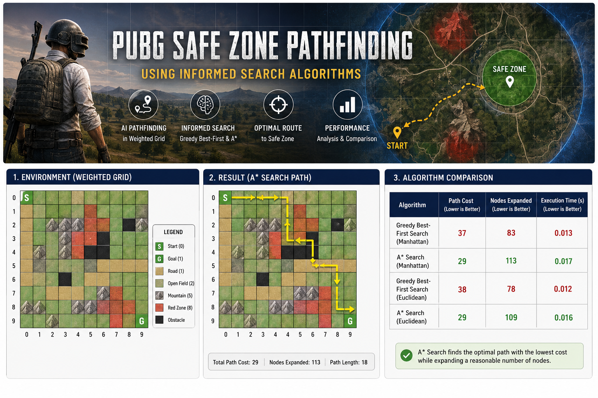
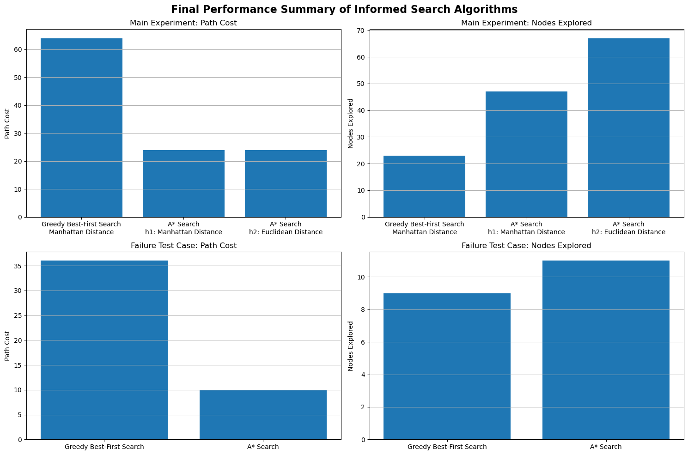

# PUBG Safe Zone Pathfinding using Informed Search Algorithms

## Overview

This project presents an AI-based pathfinding solution inspired by the PUBG battle royale environment. The objective is to navigate an autonomous agent from its starting position to the designated safe zone while minimizing movement cost and avoiding dangerous or impassable terrain.

The environment is modeled as a weighted two-dimensional grid in which every terrain type has a different traversal cost. The project demonstrates how informed search algorithms can efficiently solve shortest-path problems in weighted environments.

---

## Project Preview

<p align="center">

</p>

---

## Problem Statement

In PUBG, players must quickly reach the safe zone before the playable area shrinks. The shortest geometric path is not always the safest or the least expensive because different terrain types affect movement cost.

This project models that scenario as a weighted pathfinding problem where an intelligent agent searches for the optimal route while avoiding obstacles and minimizing total traversal cost.

---

## Objectives

- Simulate a PUBG-inspired navigation environment.
- Represent the environment as a weighted grid.
- Compare different informed search algorithms.
- Design admissible heuristic functions.
- Evaluate search efficiency and solution quality.

---

## Environment

The environment consists of multiple terrain types.

| Terrain | Description | Cost |
|----------|-------------|-----:|
| Start | Initial Position | 0 |
| Goal | Safe Zone | 1 |
| Road | Fast Movement | 1 |
| Open Field | Normal Terrain | 2 |
| Mountain | Difficult Terrain | 5 |
| Red Zone | Dangerous Area | 8 |
| Obstacle | Non Traversable | — |

---

## Algorithms Implemented

### Greedy Best-First Search

Greedy Best-First Search selects the node that appears closest to the goal according to the heuristic function. Although it often finds a solution quickly, it does not guarantee the optimal path.

### A* Search

A* combines the accumulated path cost with the heuristic estimate to produce an optimal solution whenever the heuristic is admissible.

---

## Heuristic Functions

Two admissible heuristic functions were implemented.

- Manhattan Distance
- Euclidean Distance

Both heuristics estimate the remaining distance to the goal while preserving admissibility for the search problem.

---

## Project Workflow

1. Load the weighted PUBG grid.
2. Locate the start and goal positions.
3. Generate valid neighboring states.
4. Evaluate movement cost.
5. Apply the selected informed search algorithm.
6. Construct the final path.
7. Visualize the resulting solution.

---

## Project Structure

```text
.
├── images
├── PUBG_Safe_Zone_Pathfinding_Informed_Search.ipynb
├── README.md
└── requirements.txt
```

---

## Screenshots

### Environment

<p align="center">

</p>

### Final Path

<p align="center">

</p>

### Algorithm Comparison

<p align="center">

</p>

---

## Technologies Used

- Python
- Jupyter Notebook
- NumPy
- Pandas
- Matplotlib
- Heapq

---

## Installation

Clone the repository.

```bash
git clone https://github.com/USERNAME/PUBG-Safe-Zone-Pathfinding-AI.git
```

Install the required packages.

```bash
pip install -r requirements.txt
```

Launch Jupyter Notebook.

```bash
jupyter notebook
```

Open

```
PUBG_Safe_Zone_Pathfinding_Informed_Search.ipynb
```

Run all notebook cells.

---

## Applications

This project demonstrates practical applications of informed search algorithms in

- Autonomous Navigation
- Robotics
- Intelligent Game Agents
- Route Planning
- Artificial Intelligence Education

---

## Future Improvements

- Dynamic obstacles
- Real-time safe zone updates
- Diagonal movement
- Additional search algorithms
- Larger environments
- Interactive visualization

---

## License

This project is intended for educational and research purposes.

---

## Author

**Maria Ashraf Haleem**