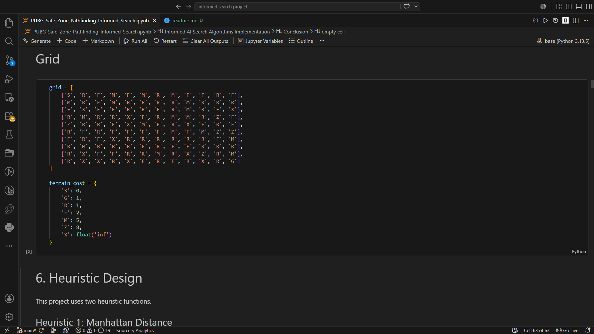
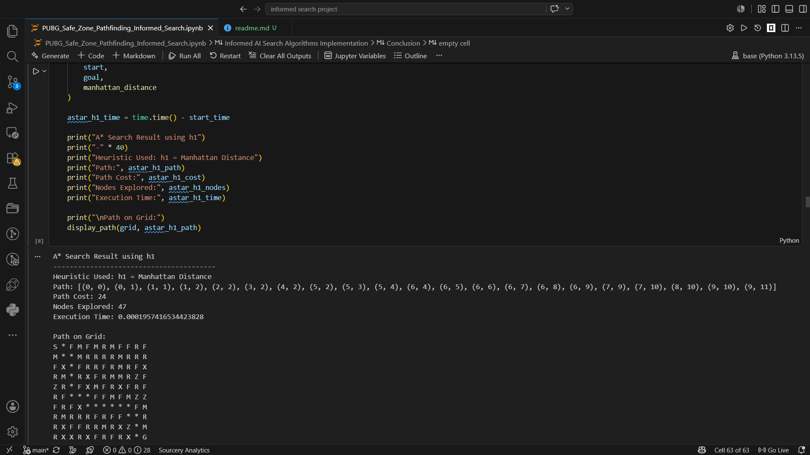

````markdown
# PUBG Safe Zone Pathfinding using Informed Search Algorithms

<p align="center">
  
</p>

<p align="center">
An Artificial Intelligence project that applies informed search algorithms to compute the optimal path toward the PUBG safe zone while minimizing traversal cost across a weighted environment.
</p>

---

## Overview

This project presents an intelligent pathfinding system inspired by the PUBG battle royale environment. The objective is to navigate an autonomous agent from a predefined starting position to the designated safe zone while minimizing movement cost and avoiding hazardous terrain.

The environment is modeled as a weighted two-dimensional grid where each terrain type has a different traversal cost. The project demonstrates how Artificial Intelligence search techniques can efficiently solve shortest-path problems in complex environments through informed search strategies.

---

## Problem Statement

Reaching the safe zone in PUBG is not simply a matter of moving in a straight line. Different terrains affect movement cost, while obstacles and dangerous regions must be considered during navigation.

This project formulates the problem as a weighted pathfinding task and applies informed search algorithms to determine an efficient route from the player's starting position to the safe zone.

---

## Objectives

- Simulate a PUBG-inspired navigation environment.
- Represent the map as a weighted grid.
- Apply informed search algorithms for intelligent navigation.
- Compare different heuristic-based search strategies.
- Evaluate path quality and search efficiency.
- Visualize the generated optimal route.

---

## Environment Representation

The environment consists of several terrain types, each associated with a traversal cost.

| Terrain | Description | Cost |
|----------|-------------|-----:|
| Start | Player Initial Position | 0 |
| Goal | Safe Zone | 1 |
| Road | Fast Movement | 1 |
| Open Field | Normal Terrain | 2 |
| Mountain | Difficult Terrain | 5 |
| Red Zone | High-Risk Area | 8 |
| Obstacle | Non-Traversable Cell | — |

---

## Search Algorithms

### Greedy Best-First Search

Greedy Best-First Search expands the node that appears closest to the goal according to the selected heuristic function. It usually finds a solution quickly but does not guarantee the optimal path.

### A* Search

A* Search combines the accumulated path cost with the heuristic estimate to produce an optimal solution whenever an admissible heuristic is used. It balances exploration cost and estimated remaining distance to the goal.

---

## Heuristic Functions

The project implements two heuristic functions commonly used in informed search.

- Manhattan Distance
- Euclidean Distance

Both heuristics estimate the remaining distance from the current node to the goal and are evaluated throughout the project.

---

## Project Workflow

1. Load the weighted PUBG environment.
2. Identify the start and goal positions.
3. Generate valid neighboring states.
4. Compute movement costs.
5. Execute the selected informed search algorithm.
6. Construct the final path.
7. Visualize the generated solution.
8. Compare algorithm performance.

---

## Project Structure

```text
PUBG-Safe-Zone-Pathfinding-AI
│
├── images
│   ├── banner.png
│   ├── weighted_grid.png
│   ├── final_path.png
│   └── comparison.png
│
├── PUBG_Safe_Zone_Pathfinding_Informed_Search.ipynb
├── requirements.txt
├── README.md
└── LICENSE
```

---

## Screenshots

### Weighted Environment

<p align="center">
  
</p>

The weighted grid illustrates the PUBG-inspired environment, including obstacles, high-cost regions, and the target safe zone.

---

### Optimal Path Generated by A*

<p align="center">
  
</p>

The generated path represents the optimal route from the player's starting position to the safe zone while minimizing traversal cost.

---

### Algorithm Performance Comparison

<p align="center">
  
</p>

Performance comparison between the implemented informed search algorithms based on solution quality, explored nodes, and execution efficiency.

---

## Technologies Used

- Python
- Jupyter Notebook
- NumPy
- Matplotlib
- Heapq
- Priority Queue
- Artificial Intelligence Search Algorithms

---

## Installation

Clone the repository.

```bash
git clone https://github.com/Maria-Ashraf-Haleem/PUBG-Safe-Zone-Pathfinding-AI.git
```

Navigate to the project directory.

```bash
cd PUBG-Safe-Zone-Pathfinding-AI
```

Install the required dependencies.

```bash
pip install -r requirements.txt
```

Launch Jupyter Notebook.

```bash
jupyter notebook
```

Open:

```
PUBG_Safe_Zone_Pathfinding_Informed_Search.ipynb
```

Run all notebook cells to reproduce the experiments.

---

## Applications

The concepts implemented in this project can be extended to various AI domains, including:

- Autonomous Navigation
- Intelligent Game Agents
- Mobile Robotics
- Route Planning
- Geographic Information Systems (GIS)
- Decision Support Systems
- Artificial Intelligence Education

---

## Future Improvements

- Dynamic obstacles.
- Real-time safe zone updates.
- Diagonal movement support.
- Additional informed and uninformed search algorithms.
- Interactive graphical user interface.
- Larger and randomly generated environments.
- Performance benchmarking on large-scale maps.

---

## License

This project was developed for educational and research purposes.

---

## Author

**Maria Ashraf Haleem**

Software Engineering Student

Faculty of Computers and Artificial Intelligence

Interested in Artificial Intelligence, Machine Learning, Intelligent Systems, and Software Engineering.
````